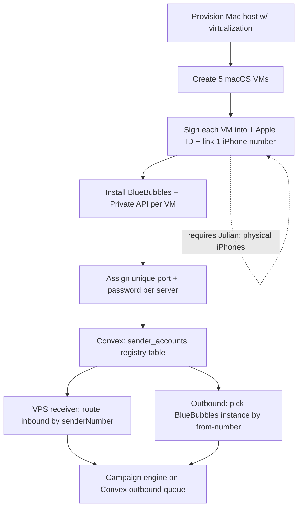

# AI-9402 — Visual Plan: 5-Number BlueBubbles + Convex Messaging

## ASCII Architecture (Recommended: VM-per-number)

```
                    ┌──────────────────────────────────────────┐
                    │         Convex (valiant-oriole-651)        │
                    │  unified inbox · sender registry · queue   │
                    │  outbound_scheduled_messages · campaigns   │
                    └───────────────▲───────────────▲────────────┘
                                    │ webhook          │ HTTP send
                       inbound ◄────┘                  └────► outbound
                                    │                  │
                    ┌───────────────┴──────────────────┴────────┐
                    │      VPS receiver  /clapcheeks/bb-webhook   │
                    │     routes by `senderNumber` → person       │
                    └───────────────▲────────────────────────────┘
                                    │  (5 webhooks, 1 per server)
        ┌──────────────┬───────────┼───────────┬──────────────┐
        │ macOS VM #1  │ VM #2     │ VM #3     │ VM #4        │ VM #5
        │ BlueBubbles  │ BlueBub.  │ BlueBub.  │ BlueBub.     │ BlueBub.
        │ :1234        │ :1235     │ :1236     │ :1237        │ :1238
        │ AppleID #1   │ AppleID#2 │ AppleID#3 │ AppleID#4    │ AppleID#5
        │ +1###1 (iPh) │ +1###2    │ +1###3    │ +1###4       │ +1###5
        └──────────────┴───────────┴───────────┴──────────────┘
              ▲ each VM linked to one iPhone's number via Messages
```

## Mermaid Dependency Graph



## Component Breakdown

| Component | Purpose | Inputs | Outputs | Dependencies |
|---|---|---|---|---|
| macOS VM x5 | Host one iMessage account each | Apple ID, iPhone number | Running Messages.app | Virtualization host (Tart/Anka/UTM) |
| BlueBubbles x5 | REST/WS bridge per number | VM Messages.app | send/react/typing API | Private API helper, SIP partial-disable |
| Convex sender registry | Map number→server URL/pw | server configs | routing decisions | Convex deploy |
| VPS receiver | Normalize inbound, dedupe | 5 webhooks | messages.upsertFromWebhook | Convex |
| Campaign engine | Schedule nurture sends | segments, templates | queued outbound | outbound_scheduled_messages |
