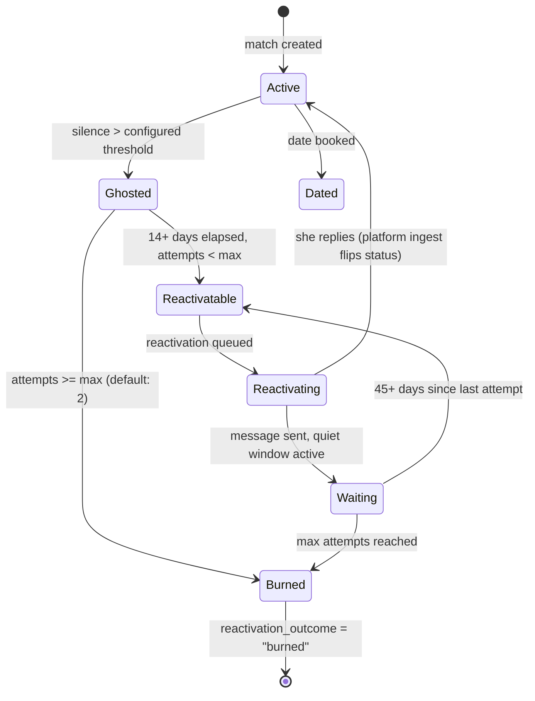

# Reactivation Campaign Playbook

**Version:** 1.0 — AI-8815  
**Status:** Production  
**Domains:** Dating, Sales, Networking, Friendship, Lapsed Clients  
**Implementation reference:** `agent/clapcheeks/followup/reactivation.py`

---

## What This Playbook Is

This is a methodology document, not a script library. It explains *why* certain re-engagement approaches work and others destroy the relationship entirely. The examples are starting points — adapt them to your voice.

It works whether you're using the Clapcheeks tooling or a calendar and a notes app.

**Ethical note:** everything in here is about creating genuine, honest re-engagement that respects the other person's right to say no. Nothing here is manipulation. The moment you're trying to engineer a response through guilt or pressure, you've left the playbook.

---

## Part 1: Universal Strategy

---

### 1.1 The Core Problem with Most Re-engagement Attempts

Most people fail at re-engagement before they even write a word. The failure is conceptual.

They frame the re-engagement as: *"I need to address the fact that they went quiet."*

This framing is wrong. It puts the silence at the center. The silence is not the story. The silence is background noise.

The right frame is: *"I thought of something real about this person, and I'm sharing it."*

That's it. That's the entire methodology in one sentence. Everything below is detail on how to execute it.

---

### 1.2 Why Gap-Acknowledgment Fails

Research from Nature Communications (2024) on reconnecting with old friends found a counterintuitive pattern: people massively overestimate the awkwardness of reconnecting and underestimate how positively their outreach is received. But the people who fail to reconnect share a common mistake — they focus on the gap rather than the person.

When you open with "it's been a while" or "hey stranger," you're doing two things:
1. Forcing the recipient to consciously recall why they stopped responding
2. Signaling that you've been tracking the silence — which reads as either anxious or accusatory

The brain reads "it's been a while" as an implicit question: *"why haven't you reached out?"* Even if that's not your intent, the receiver has to answer that question internally before they can respond to you. Most people, when asked an uncomfortable question, choose non-answer.

The MIT Sloan Management Review research on dormant ties (Levin, Walter, Murnighan) found something that reframes this entirely: dormant relationships don't degrade the way people expect. Trust and goodwill are largely preserved, even after years. The awkwardness people anticipate is mostly imagined. Reconnecting feels like picking up where you left off — *if you don't make the gap the centerpiece*.

**Practical rule: jump over the gap. Treat the silence as neutral. Start where you are now.**

---

### 1.3 The Timing Ladder

This is the most important structural element of any reactivation campaign. Derived from cross-domain analysis of Klaviyo win-back benchmarks, Mark Manson's three-chance framework, and Bloomreach's lapsed-customer cadence:

| Window | What Happens | Why |
|--------|-------------|-----|
| Day 0 | Contact goes quiet | Don't reach out yet |
| Day 1-13 | Quiet period | Too soon. They may still be processing. Reaching out now signals impatience. |
| Day 14 | Attempt 1 eligible | Enough time for emotional friction to fade. Not so long they've forgotten you. |
| Day 14-59 after attempt 1 | Quiet window | If attempt 1 got no reply, let it breathe. |
| Day 60 after attempt 1 | Attempt 2 eligible | If you try again, this is your last shot. Make it count, but keep it light. |
| After attempt 2 with no reply | Burned | Two fair chances given. Mark it closed. Move on. |

These aren't arbitrary. The 14-day first-attempt window maps directly to Klaviyo's "1.5x the average interaction gap" formula applied to early-stage conversations. The 45-60 day quiet window between attempts matches Robert Greene's absence-creates-desire principle — enough time that your return feels like a genuine surprise rather than a relentless follow-up.

---

### 1.4 The Message Formula

Every effective reactivation message has three components. None of them are optional. Some can be implied, but not skipped.

```
[Specific reference] + [New information or low-pressure signal] + [Optional: soft invite]
```

**Specific reference** — something that anchors the message to this person specifically. Not "hey" — that could go to anyone. Something that makes them think "they remembered that?"

**New information or low-pressure signal** — what's new since you last talked? Something about you, something in the world, something you saw. Or simply: the lightness of the message itself signals "I'm doing fine and thought of you."

**Optional soft invite** — a very loose, take-it-or-leave-it invitation. "would be fun to grab a drink if you're around sometime." Not a calendar invite. Not a specific time. Just an open door.

---

### 1.5 The Message Length Rule

Under 15 words. For most contexts — under 10.

This sounds aggressive, but it's backed by every framework we researched. Here's why it matters:

A long message signals effort. Effort signals attachment. Attachment signals you've been thinking about this for days, which signals that the silence affected you more than it should have, which signals that they have power over you.

A short, casual message signals the opposite: you thought of them spontaneously, wrote it in 30 seconds, and sent it. Exactly the way you'd text a friend you randomly thought of. 

The message doesn't need to be impressive. It needs to feel like you didn't try.

---

### 1.6 Banned Phrases (Universal)

These fail in every domain — dating, sales, networking, client recovery. Do not use them:

| Phrase | Why It Fails |
|--------|-------------|
| "Hey stranger" | Mass outreach signal. Nobody says this to someone they genuinely thought of. |
| "Long time no talk/see" | Gap-naming. Forces them to sit in the awkwardness. |
| "Just checking in" | Signals zero real reason to contact. Pure obligation. |
| "Circling back" | Pure sales-speak. Confirms you're working from a script. |
| "Touching base" | Same as circling back. |
| "Bumping this" | Visible automation. Confirms they're on a list. |
| "Did I do something wrong?" | Guilt-induction. Creates emotional pressure that triggers avoidance. |
| "Miss me?" | Clingy, presumptuous. |
| "Remember me?" | Self-deprecating in a way that doesn't work. |
| "I know it's been a while" | Gap-naming again. |
| "Hope you're doing well" | Precedes 100% of cold outreach. Pattern-matched to "template." |
| "I've been meaning to reach out" | You've been overthinking this. Don't narrate it. |
| "Following up on my last message" | Reminds them they already ignored you. |

Full machine-readable list with replacements: `docs/playbooks/banned-phrases.json`

---

### 1.7 When to Walk Away

Two attempts. Then stop.

This is consistent across every framework in the research:
- Mark Manson: three chances total (including the original conversation)
- Klaviyo: three-email winback, then sunset non-responders
- Aaron Ross / Predictable Revenue: hard stop on lapsed leads after defined attempts
- Bloomreach: automatic unsubscribe after winback sequence with no engagement

Walking away is not failure. It's respect — for the other person's right to say no, and for your own time. Continuing to reach out after two ignored attempts is neither kind nor effective. It's just an easier way to feel like you did something.

When you walk away, you also preserve the relationship for a genuinely different future context. A contact you politely stopped pursuing is recoverable. A contact you harassed is not.

---

## Part 2: Clapcheeks Implementation

---

### 2.1 State Machine Overview



The full implementation lives in `agent/clapcheeks/followup/drip.py`. The reactivation-specific prompt builder is in `agent/clapcheeks/followup/reactivation.py`.

---

### 2.2 Key Configuration Values

```python
# From DEFAULT_CADENCE in drip.py
"reactivation_first_attempt_days": 14.0   # days after ghosted -> first attempt
"reactivation_followup_days": 45.0         # days between attempts
"reactivation_max_attempts": 2             # hard cap; beyond this -> burned
"reactivation_quiet_window_days": 60.0     # do not re-attempt within N days of last
```

These are overridable per user via `persona.followup_cadence` in `clapcheeks_user_settings`.

---

### 2.3 Template Selection Logic

The `build_reactivation_prompt` function in `reactivation.py` selects a template based on the stage when the match went quiet:

| Stage | Template Focus |
|-------|---------------|
| `opened` | Opener sent, no reply. Reference something from profile, 10 words max. |
| `conversing` | Mid-conversation stall. Reference the conversation's last real topic. |
| `date_proposed` | Date ask was ignored. Pop back in casually, no mention of the ask. |
| `default` | Fallback for unknown stages. Light, genuine, 10 words max. |

---

### 2.4 Sanitizer Integration

All reactivation drafts pass through `clapcheeks.ai.sanitizer.sanitize_and_validate` before queuing. The sanitizer checks for banned phrases (configured in `persona.banned_words`), banned punctuation (em-dashes, semicolons), Unicode glyphs, and length limits.

To extend the banned-phrase list from this playbook's `banned-phrases.json`:

```python
# In your persona configuration or sanitizer loader:
import json

with open("docs/playbooks/banned-phrases.json") as f:
    data = json.load(f)

# Filter by domain and severity
domain = "dating"
banned = [
    p["phrase"] for p in data["banned_phrases"]
    if domain in p["domains"] and p["severity"] in ("critical", "high")
]
```

The sanitizer will reject any draft containing these phrases and log the discard.

---

### 2.5 Opt-Out and Override

Per-match opt-out: set `reactivation_disabled = true` on the match row. The state machine returns `noop` immediately.

Terminal outcomes: `reactivation_outcome` values of `"burned"`, `"ignored"`, or `"opted_out"` are permanent. Once set, the reactivation arm exits.

---

## Part 3: Cross-Domain Adaptations

---

### 3.1 Sales Nurture — Dead Lead Reactivation

**Context:** A prospect went through your pipeline, had calls, maybe a demo, then went quiet. They haven't responded in 2+ months.

**What doesn't work:** "Just wanted to follow up on the proposal we sent." They know. That's why they went quiet.

**What works:**

**Stage: Early-stage ghost (one call, then silence)**

Good example:
> "[Name] — we just shipped the integration you asked about in our call. might be a different conversation now."

Why it works: Specific reference to something they cared about. New information (the integration shipped). Zero pressure. If the integration matters to them, they'll reply. If it doesn't, you've learned something.

Bad example:
> "Hi [Name], just checking in to see if you've had a chance to review the proposal I sent over. I know you were busy — totally understand. Let me know if you have any questions!"

Why it fails: "just checking in" is dead on arrival. "I know you were busy" is an implicit guilt-trip. "Let me know if you have any questions" is a non-ask. The whole thing signals that you have no other prospects.

---

**Stage: Post-demo ghost (they saw it, then silence)**

Good example:
> "quick thought — [specific pain point from their demo call]. we fixed that last week. different story now if you want to take another look."

Why it works: Specific reference to something real they raised. New information. The phrase "different story now" is a light invitation to re-evaluate, not a pressure to decide.

Bad example:
> "Hi [Name], circling back on the demo from last month. You mentioned ROI was a concern — I wanted to address that. We have some case studies that might help. Would love to hop on a 15-minute call to discuss. How does next week look?"

Why it fails: "circling back" is template-speak. The immediate ask for a call before they've re-engaged adds friction. The specificity in the bad example is actually there — but it's buried under process narration that signals CRM automation.

---

**The sales walk-away message (use only after 2 failed attempts):**
> "[Name] — going to stop nudging. if the timing changes, you know where to find me."

Why it works: clean, no guilt, leaves the door open. The brevity signals confidence. Many prospects reply to this one — it's a pattern sometimes called the "break-up email" in B2B sales, and its conversion rate is disproportionately high relative to the effort.

---

### 3.2 Networking Re-engagement — Dormant Professional Contacts

**Context:** Someone you met at a conference, worked with at a previous job, or connected with online. You haven't talked in 6-18 months.

**The MIT Sloan advantage:** Dormant ties provide *more* novel value than active ties because they've been accumulating new experiences while the connection was dormant. You're not just reactivating a relationship — you're accessing someone who has grown since you last talked. Lead with curiosity about what they've built, not with what you need.

**Good example — conference contact, 8 months dormant:**
> "saw that [their company] just closed the series B. congrats. that launch you mentioned is probably a different conversation now."

Why it works: Specific reference (the conversation you had), new information (they closed funding), light question implied (what does the launch look like now?). You did one minute of LinkedIn research and it shows.

**Bad example:**
> "Hi [Name], hope you're doing well! I wanted to reconnect and see if there might be any opportunities for us to collaborate. I've been keeping an eye on what [company] is doing and I'm impressed. Would love to catch up over coffee sometime. Let me know if you're free!"

Why it fails: "hope you're doing well" is a template opener. "wanted to reconnect" is process narration. "see if there might be any opportunities" signals you want something from them. "coffee sometime" with no specificity is a soft invite that easy to say yes to in theory and forget in practice.

**Good example — former colleague, 1 year dormant:**
> "hey — random question. you were deep in [specific technology] at [old company]. still thinking about it? working on something and you'd have an opinion."

Why it works: Specific to their expertise, signals you value their perspective (not just their network), framed as a genuine question not a request. The phrase "you'd have an opinion" is a compliment that doesn't feel like one.

---

### 3.3 Friendship Re-engagement — Lost Touch with a Friend

**Context:** A friend you've grown apart from — moved cities, life got busy, different seasons. You've thought about reaching out for months. This is the hardest category because the stakes feel personal.

**The research insight:** People are surprisingly hesitant to reach out to old friends — and systematically underestimate how welcome the outreach will be. In a 2024 Nature Communications study, over 90% of people could name a friend they wanted to reconnect with, but only a third actually sent a message when given the opportunity. The reluctance is mostly imagined. Send the message.

**Good example — friend from college, 2 years dormant:**
> "just watched [show/movie you know they'd love]. remembered you'd been waiting for it. was i right?"

Why it works: Something specific they cared about, a genuine question, zero pressure. The question gives them an easy, fun reply. It also signals you remember the real things about them, not just that you exist.

**Bad example:**
> "hey! omg it's been forever. i've been meaning to reach out for so long. life has just been so crazy. how are you? what are you up to? we should definitely hang out soon!"

Why it fails: Every sentence signals mass or obligation outreach. "it's been forever" draws attention to the gap. "i've been meaning to reach out" narrates your failure to do so. "how are you?" is a social pleasantry that doesn't require a real answer. "we should definitely hang out soon" is a soft commit that goes nowhere.

**Good example — friend who moved to another city:**
> "coming to [their city] for [real reason] next month. if you're around, i'm buying."

Why it works: Specific, concrete, low-pressure, you're offering value (your visit + the drink). They don't have to commit to anything — they can say "great, when?" or let it go. Either way is fine.

---

### 3.4 Lapsed Client Re-engagement

**Context:** A former client whose contract ended, or who went quiet after a proposal. You want to see if there's a renewed fit.

**Unique challenge:** Unlike dating or friendship, there's an explicit commercial context. You can't ignore it — but you also can't lead with it. The key is leading with genuine value and letting the commercial conversation follow naturally.

**Good example — client who churned 6 months ago:**
> "[Name] — we just released [specific feature they requested when they left]. thought you'd want to know."

Why it works: Specific (the feature they asked for), new information (it shipped), no sales pitch embedded. If they care about the feature, they'll ask about pricing themselves.

**Bad example:**
> "Hi [Name], hope you're well! I wanted to touch base and see if your needs have evolved since we last worked together. We've made a lot of improvements to the platform that I think would be relevant to your team. Would love to schedule a call to reconnect!"

Why it fails: "touch base" is dead. "hope you're well" is dead. "your needs have evolved" is generic. "a lot of improvements" is vague. "schedule a call" is a demand before re-engagement.

**Good example — lapsed client, proposal ignored:**
> "one thought I forgot to include in the proposal: [specific thing relevant to their business]. probably changes the math."

Why it works: Specific, new information, implies you've been thinking about their problem specifically. "probably changes the math" is a light invite to revisit without demanding it.

**The lapsed-client walk-away:**
> "[Name] — going to leave this one here. if the timing changes or you want a different approach, happy to pick this up. best of luck with [specific project you know about]."

Why it works: Clean close, no guilt, specific enough to feel human, leaves the door open with zero pressure.

---

## Part 4: Operator Playbook — No Tooling Required

---

### 4.1 What You Need

- A way to track contacts (spreadsheet, Notion, Apple Notes — anything works)
- A calendar for reminders
- The reactivation tracker template: `docs/playbooks/templates/reactivation-tracker.md`
- This playbook

That's it. No software, no automation, no AI required.

---

### 4.2 Step-by-Step for a Single Contact

**Day 0: They go quiet**

Add them to your tracker with today's date. Set a calendar reminder for Day 14. Close the tracker. Don't think about it until then.

This is important: the waiting is structural, not emotional. You're not "giving it time" in the hope they'll miss you. You're waiting because reaching out before Day 14 signals impatience, and impatience is unattractive in every context.

---

**Day 14: Write Attempt 1**

Open the tracker. Look at what you know about this person:
- What was the last real thing you discussed?
- What do you know about their interests, job, life?
- What's happened in the world or in your life that connects to who they are?

Write a message in under 60 seconds. Under 15 words. Don't reference the gap. Don't apologize. Jump straight to the content.

If you can't think of anything genuine to say: set the reminder for Day 21 and try again then. A bad message sent on schedule is worse than a good message sent a week late.

---

**After Attempt 1**

- If they reply: great. Continue the conversation.
- If no reply: set a calendar reminder for Day 60 after attempt 1. Close the tracker. Move on with your life. Do not think about this person until the reminder fires.

---

**Day 60 after Attempt 1: Write Attempt 2 (if you want to)**

This is optional. Two attempts is the standard. One attempt is entirely valid. Never more than two.

Attempt 2 should feel different from Attempt 1. Don't repeat the same angle. Find something new:
- Something that happened in your life that they'd find interesting
- A low-pressure, specific invite to something real
- A genuinely different observation about something in their world

---

**After Attempt 2**

- If they reply: great.
- If no reply: mark them burned in the tracker. Do not reach out again. Ever. This isn't about giving up — it's about respecting that two messages with no response is a clear signal, and continuing beyond that harms your reputation and their peace.

---

### 4.3 Managing Multiple Contacts

Use the tracker template to manage up to 20-30 active reactivations at once. Set weekly calendar blocks (15 min) to:

1. Review who has a reminder firing this week
2. Write messages for eligible contacts
3. Update the tracker with results
4. Mark burned any contacts whose second attempt got no reply

If you're managing more than 30, you need a spreadsheet and likely some automation. The Clapcheeks tooling handles this automatically at scale.

---

### 4.4 Choosing What to Say — A Practical Method

When you sit down to write the message, run through this checklist:

**The 5-second scan:**
1. Look at the last 3 things you know about this person
2. What happened in the world this week that connects to any of them?
3. What happened in your life this week that they'd find interesting?

If one of those questions generates a genuine thought, that's your message. If none of them do, wait.

**The 10-word test:**
Write your core message. Remove every word that doesn't carry weight. If what's left makes sense, send it.

**The "would I say this to a friend?" test:**
Would you say this exact thing, out loud, to a friend you randomly ran into? If yes, send it. If it would sound weird out loud, it'll sound weird in text.

---

### 4.5 The Confidence Calibration Check

Before you send: notice how attached you feel to the outcome.

If you're refreshing your messages app 10 minutes after sending: that's attachment. It leaks into the message itself — often through length, over-explanation, or a subtle pressure in the word choices.

The messages that convert are the ones written and sent without urgency. The sender genuinely moved on and happened to think of the person. That casualness is detectable. Manufacture it by actually moving on, not by pretending to.

Practical: write the message, put your phone down, do something else for an hour. Then decide whether to send.

---

## Example Library

### Section A: Good Examples (12 messages, 3 stages × 4 domains)

---

**Dating / Opener Ghost (Attempt 1)**

Scenario: You matched on Hinge, sent an opener about her love of bouldering, she never replied. 17 days later.

> "bet you've crushed v5 by now"

Why it works: Specific reference (bouldering from her profile), light assumption that she's progressed, 7 words, no mention of the match or the silence. It's the kind of message you'd send a friend who climbs.

---

**Dating / Mid-Conversation Ghost (Attempt 1)**

Scenario: You were talking for a week, she went quiet mid-thread about where to eat in your city. 15 days later.

> "went to [restaurant you mentioned] — you were right about the wait"

Why it works: Direct callback to the conversation topic, new information (you actually went), gives her something to respond to without requiring any emotional processing.

---

**Dating / Post-Date-Ask Ghost (Attempt 2)**

Scenario: You asked her out, she didn't confirm, it fizzled. Attempt 1 was ignored. 50 days later.

> "going to [event related to her interests] next weekend — thought you might be into it"

Why it works: Specific invite that doesn't require her to admit she ignored the date ask. It's a fresh start. The invite is real and specific enough to be credible.

---

**Sales / Early-Stage Ghost (Attempt 1)**

Scenario: Discovery call went well, sent the proposal, no response for 3 weeks.

> "[Name] — we just added the [specific integration they asked about]. might change your math on the timing."

Why it works: Specific to their ask, new information, invites re-evaluation without demanding it.

---

**Sales / Post-Demo Ghost (Attempt 2)**

Scenario: Demo was positive, they said they'd discuss internally, then disappeared. Attempt 1 ignored. 6 weeks later.

> "one thing I forgot to mention in the demo: [specific capability relevant to their use case]. worth a 20-minute conversation if the timing works."

Why it works: Genuinely new information (not a repeat), specific to their context, the time ask is specific (20 min) and light.

---

**Sales / Walk-Away (Final)**

Scenario: Two attempts with no reply.

> "[Name] — going to leave this one here. if anything changes, you know where to find me."

Why it works: Clean close, no guilt, signals confidence. Often triggers replies from people who were genuinely just busy and felt bad about not responding sooner.

---

**Networking / Conference Contact Ghost (Attempt 1)**

Scenario: Met at a conference, had a great conversation about their pivot, connected on LinkedIn, then silence for 4 months.

> "saw you're at [new role/company] now. how's the pivot going?"

Why it works: Specific (their career move), genuine curiosity question, no agenda.

---

**Networking / Former Colleague Ghost (Attempt 1)**

Scenario: Worked together 2 years ago, connected on LinkedIn but never really talked after you both left the company.

> "randomly — do you still know [specific technical area]? working on something and your brain would help."

Why it works: Specific to their expertise, frames them as valuable, the "randomly" signals it's a genuine thought not a planned outreach.

---

**Friendship / College Friend Ghost (Attempt 1)**

Scenario: Best friend from college, you've both been busy, 18 months since last real conversation.

> "finally watched [show they recommended]. you were right."

Why it works: Calls back to something they told you about, validates their recommendation, easy to reply to ("wasn't it incredible?").

---

**Friendship / Long-Dormant Friend (Attempt 2)**

Scenario: Attempt 1 ("saw this and thought of you" link to something relevant) was ignored. 6 weeks later.

> "coming to [their city] in [month]. if you're around, i owe you a drink."

Why it works: Concrete, specific, low-pressure, you're offering value (the drink, the visit). They can engage or not — either signal is useful.

---

**Lapsed Client / Churned on Pricing (Attempt 1)**

Scenario: Client left because the pricing didn't fit their budget. 5 months later, you've launched a new tier.

> "[Name] — we just launched a [tier name] plan at [price]. might be the conversation we should have had last time."

Why it works: Specific to why they left, new information (new tier), doesn't require them to admit the previous churn was wrong.

---

**Lapsed Client / Proposal Ignored (Attempt 2)**

Scenario: Proposal was ignored. Attempt 1 ("one thing I forgot") got no reply. 45 days later.

> "going to leave this one here — if the timing shifts or you want a different approach, I'm easy to reach. good luck with [specific initiative they mentioned]."

Why it works: Clean walk-away that doesn't burn the relationship. The specific reference at the end proves this is a human message, not a template.

---

### Section B: Bad Examples (12 messages, with explanations)

---

**Dating / Opener Ghost — Wrong**

> "hey stranger! it's been a while haha. wanted to check in and see if you're still active on here? would love to grab coffee if you're interested :)"

Why it fails: "hey stranger" + "it's been a while" + "wanted to check in" — three banned phrases in the first two sentences. The exclamation marks and emoji signal effort. "Still active on here" is passive-aggressive (implying she's ignoring you). The question format makes it easy to not reply.

---

**Dating / Mid-Conversation Ghost — Wrong**

> "did i say something wrong? i thought we were having a good conversation but then you went quiet. just wanted to check in and make sure everything is okay"

Why it fails: Opens with guilt-induction. "I thought we were having a good conversation" is fishing for validation. "Went quiet" labels the behavior you're trying to move past. This is the message that cements the ghost rather than ending it.

---

**Dating / Post-Date-Ask Ghost — Wrong**

> "hey! so i guess you're not interested anymore? i asked you out and never heard back lol. no worries if that's the case, just would have appreciated a response. anyway hope you're doing well!"

Why it fails: Passive-aggressive throughout. "I guess you're not interested anymore" is a question that forces an uncomfortable answer. "Would have appreciated a response" is a mild scolding. "No worries" + "anyway" signal emotional damage control. "Hope you're doing well!" is a template closer. This message ensures she never responds.

---

**Sales / Early-Stage Ghost — Wrong**

> "Hi [Name], just circling back on the proposal I sent three weeks ago. I wanted to see if you had a chance to review it and if you had any questions. Happy to jump on a quick call this week to walk through it. How does your schedule look?"

Why it fails: "Circling back" is dead. "I wanted to see if you had a chance" is mealy-mouthed. Three questions in one message adds decision friction. The ask for a meeting before they've re-engaged is too much.

---

**Sales / Post-Demo Ghost — Wrong**

> "Hi [Name], hope all is well! Following up on our demo from last month. I know you mentioned you'd take it to your team — just wanted to see where things landed. We have some great case studies that might help move things forward internally. Would love to reconnect!"

Why it fails: "Hope all is well" is a template opener. "Following up" is process narration. "I know you mentioned" is subtle pressure (proving you remember their commitment). "Would love to reconnect" is vague. The case studies offer is a burden, not a value add.

---

**Sales / Walk-Away — Wrong**

> "Hi [Name], this is my last attempt to reach out. I've tried reaching you multiple times and haven't heard back. I just want to make sure everything is okay and that I haven't done anything to upset you. Please let me know either way. I value our potential partnership and hope we can work together."

Why it fails: Guilt-induction in every sentence. "My last attempt" is manipulative framing. "I just want to make sure everything is okay" is passive. "I haven't done anything to upset you" is fishing. "Please let me know either way" is a demand for emotional labor. The word "partnership" before any deal exists is premature.

---

**Networking / Conference Contact Ghost — Wrong**

> "Hi [Name], hope you've been well! I've been meaning to reach out since we met at [conference] — life just got so busy. I'd love to reconnect and see if there might be some synergies between what we're both doing. Would you be open to a 30-minute coffee chat?"

Why it fails: "Hope you've been well" + "been meaning to reach out" + "life just got so busy" — trifecta of filler and self-excuse. "Synergies" is corporate nonsense. A 30-minute coffee chat ask as the first message after months of silence is too much friction.

---

**Networking / Former Colleague Ghost — Wrong**

> "Hey [Name]! Long time no talk! I've been keeping an eye on what you've been up to and it looks like you've been doing great things. I'm working on something new and would love to pick your brain sometime. Let me know if you're free for a call!"

Why it fails: "Long time no talk" is gap-naming. "Keeping an eye on what you've been up to" reads as surveillance, not genuine interest. "Pick your brain" is a request that gives them nothing. "Let me know if you're free" is a low-commitment ask that's easy to defer.

---

**Friendship / College Friend Ghost — Wrong**

> "omg hey!! it literally feels like forever. i've been so bad at keeping in touch and i feel so guilty about it. we really need to hang out soon — i miss you! how has everything been??"

Why it fails: Opens with self-flagellation (guilt-tripping yourself is still guilt-tripping). "We really need to hang out soon" is a soft commitment that goes nowhere. "How has everything been?" is a social question that doesn't require a real answer.

---

**Friendship / Long-Dormant Ghost — Wrong**

> "hey. sorry for the late reply. i know it's been way too long. i've been going through a lot and just haven't had the bandwidth to keep up with people. i hope you understand. i miss our friendship and would love to reconnect when things calm down."

Why it fails: Opens with apology and then immediately explains why it's not really the sender's fault. "When things calm down" is not a plan — it's a deferral. The whole message is about the sender's internal state, not the recipient.

---

**Lapsed Client / Churned — Wrong**

> "Hi [Name], hope everything is going well with [company]. I wanted to touch base and see if your situation has changed since we last worked together. We've made a lot of improvements since then and I think you'd be impressed. Would love to get your thoughts over a quick call."

Why it fails: "Touch base" is dead. "I think you'd be impressed" is telling them how to feel. "A lot of improvements" is generic. The call ask before re-engagement is too much too soon.

---

**Lapsed Client / Final Walk-Away — Wrong**

> "Hi [Name], I've now reached out multiple times and haven't heard back. I want to be respectful of your time, but I also want to make sure we've fully explored whether there's an opportunity here. If you're not interested, I completely understand, but I'd appreciate just a quick yes or no. Thank you for your time."

Why it fails: Leads with a subtle accusation ("I've now reached out multiple times"). "I want to be respectful of your time" is contradicted by what follows. "A quick yes or no" is a guilt-inducing demand for emotional labor. "Thank you for your time" is passive-aggressive in context.

---

## Bibliography

1. Levin, D.Z., Walter, J., & Murnighan, J.K. — "The Power of Reconnection: How Dormant Ties Can Surprise You." MIT Sloan Management Review. https://sloanreview.mit.edu/article/the-power-of-reconnection-how-dormant-ties-can-surprise-you/

2. Perkins, A.W., et al. — "People are surprisingly hesitant to reach out to old friends." Nature Communications Psychology, 2024. https://www.nature.com/articles/s44271-024-00075-8

3. Cialdini, R.B. — *Influence: The Psychology of Persuasion*. Overview: https://cxl.com/blog/cialdinis-principles-persuasion/

4. Manson, M. — *Models: Attract Women Through Honesty*. Summary: https://thepowermoves.com/models/

5. Greene, R. — *The Art of Seduction*. Methodology extraction (absence, patience, timing): https://thepowermoves.com/the-art-of-seduction-summary/

6. Ferrazzi, K. — *Never Eat Alone*. Summary: https://readingraphics.com/book-summary-never-eat-alone/

7. Ross, A. & Tyler, M. — *Predictable Revenue*. Re-ignition playbook: https://www.saastr.com/re-igniting-growth-with-predictable-revenue/

8. Klaviyo — Win-Back Email Campaign Best Practices. https://www.klaviyo.com/blog/winback-email-campaign-examples

9. Braze — What Is a Win-Back Campaign? https://www.braze.com/resources/articles/what-is-a-win-back-campaign-anyway

10. Bloomreach — Reactivation Campaign for Lapsing and Lapsed Customers. https://documentation.bloomreach.com/engagement/docs/reactivation-campaign-for-lapsing-and-lapsed

11. Powered by Search — B2B SaaS Reactivation Emails for Dead Leads. https://www.poweredbysearch.com/blog/dead-lead-reviver/

12. Gainsight — Essential Guide to Customer Churn. https://www.gainsight.com/essential-guide/churn/

13. Altior & Co — B2B SaaS Churn Reduction Playbook. https://altiorco.com/resources/blog/churn-reduction

14. National Geographic — "It's hard to reconnect with old friends." https://www.nationalgeographic.com/science/article/reconnect-old-friends-loneliness-social-media

---

*This playbook is part of the Clapcheeks methodology library. For the decision tree: `docs/playbooks/templates/reactivation-decision-tree.md`. For the contact tracker: `docs/playbooks/templates/reactivation-tracker.md`. For banned phrases JSON: `docs/playbooks/banned-phrases.json`.*
