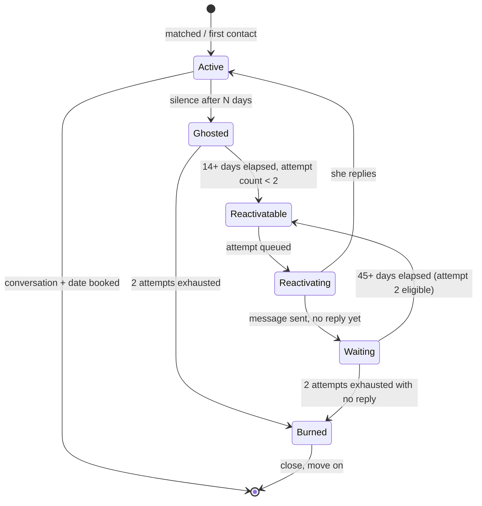

# Reactivation Decision Tree

Use this before writing any re-engagement message. Answer each question in order.

---

## ASCII Decision Tree

```
START: Should I reach out to this ghosted contact?
|
+-- Has it been fewer than 14 days since they went quiet?
|   |
|   YES --> WAIT. Too soon. They may still be processing.
|           Set a calendar reminder for day 14.
|   |
|   NO --> Continue.
|
+-- Have I already sent 2 reactivation attempts?
|   |
|   YES --> STOP. You've given them two fair chances.
|           Mark as burned. Move on.
|   |
|   NO --> Continue.
|
+-- Did I attempt to reach out less than 45 days ago?
|   |
|   YES --> WAIT. Quiet window active. Too soon for attempt 2.
|           Set a reminder for day 45 after last attempt.
|   |
|   NO --> Continue.
|
+-- Do I have a specific, genuine reason to reach out?
|   (a memory from the conversation, something on their profile,
|    a shared interest, something new in your life)
|   |
|   NO --> WAIT. Don't reach out with nothing to say.
|          Wait until something real comes to mind.
|   |
|   YES --> Continue.
|
+-- Is my intended message under 15 words?
|   |
|   NO --> Shorten it. If you can't say it in 15 words,
|          you're working too hard. Working hard signals attachment.
|   |
|   YES --> Continue.
|
+-- Does my message mention the gap?
|   ("it's been a while", "long time no talk", "hey stranger")
|   |
|   YES --> Remove it. Jump straight to the content.
|          The gap is neutral. Don't make it loaded.
|   |
|   NO --> Continue.
|
+-- Does my message guilt-trip or pressure them?
|   ("did I do something wrong?", "I've been waiting", "miss me?")
|   |
|   YES --> Start over. The message is coming from a
|          place of attachment, not abundance.
|   |
|   NO --> SEND IT.
```

---

## Plain English Version

**Step 1 — Check timing**
- If it's been fewer than 14 days: wait.
- If you already sent one attempt and it's been fewer than 45 days: wait.
- If you've sent 2 attempts: stop. Mark them burned.

**Step 2 — Check your reason**
You need a real reason. Not "I want to try again." That's not a reason — that's a feeling. A real reason is:
- Something from your last conversation you can reference
- Something you saw that made you think of them specifically
- Something new in your life that connects to who they are
- A genuine, low-pressure invite to something relevant

If you don't have a real reason, wait until you do.

**Step 3 — Write the message**
Under 15 words. Lowercase (for apps/texts). No gap-acknowledgment. No guilt. No apology.

**Step 4 — Read it out loud**
Does it sound like something you'd say to a friend you thought of randomly? Good. Send it.
Does it sound like you've been thinking about sending this for days? Rewrite it.

**Step 5 — After sending**
- If they reply: great. Continue the conversation.
- If no reply in 45 days: optional second attempt following the same rules.
- If no reply to 2 attempts: mark burned. Done.

---

## State Machine (Mermaid)



---

## One-Page Summary Card

Print this. Put it somewhere visible.

```
+------------------------------------------------------+
| REACTIVATION — THE RULES                             |
|                                                      |
| WAIT  14 days before attempt 1                       |
| WAIT  45 days before attempt 2 (from attempt 1)      |
| STOP  after 2 attempts with no reply                 |
|                                                      |
| DO:                                                  |
|  - Specific reference to them or your life           |
|  - Under 15 words                                    |
|  - Lowercase, casual                                 |
|  - Jump over the gap                                 |
|                                                      |
| DON'T:                                               |
|  - Name the gap ("it's been a while")                |
|  - Apologize for the silence                         |
|  - Guilt-trip ("did I do something wrong?")          |
|  - Ask if they remember you                          |
|  - Write more than you'd say in a hallway            |
+------------------------------------------------------+
```
